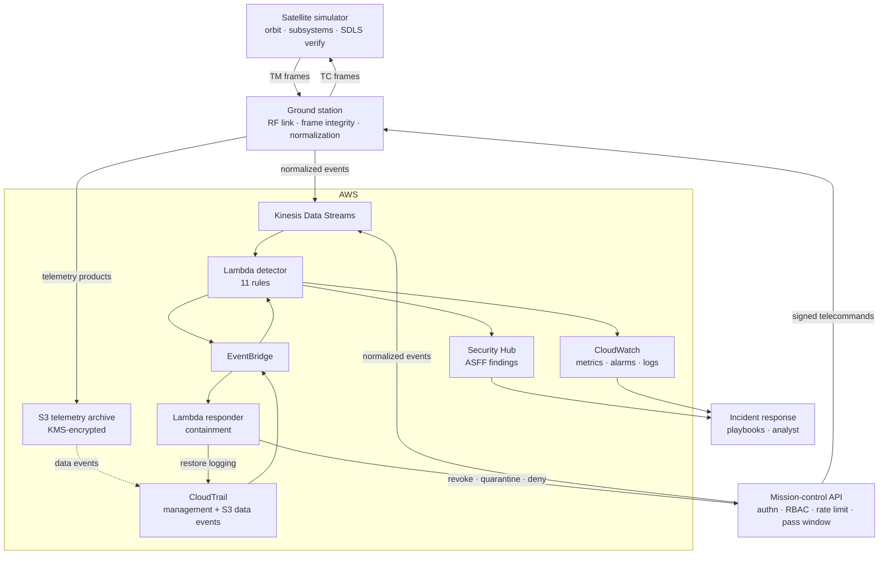
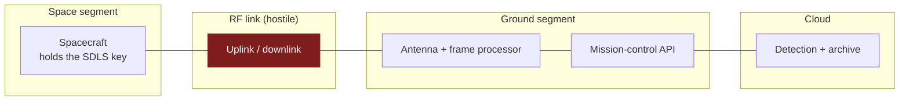
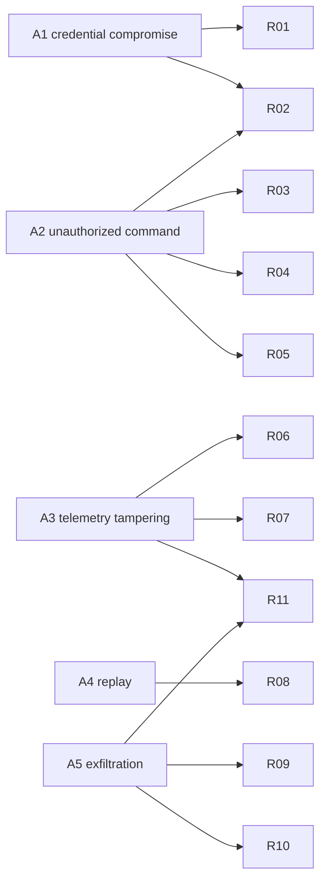

# Architecture

## Research question

> **Can cloud-native security telemetry effectively detect cyberattacks against
> simulated satellite ground segments?**

The architecture below exists to make that question measurable: every layer emits
a normalized event, every event reaches one analytics tier, and every detection
is timestamped against the moment the attack started.

## End-to-end flow

Two paths matter and they have very different latency:

* **Stream path** (`Kinesis → Lambda`): seconds. Everything the ground segment
  itself observes - authentication, telecommands, frame integrity - takes it.
* **Control-plane path** (`CloudTrail → EventBridge → Lambda`): seconds to a few
  minutes, bounded by CloudTrail's own delivery latency, which the testbed models
  as a fixed batch latency rather than pretending it is instant.

## Trust boundaries

| Boundary | Assumption | Control | Attack that tests it |
|---|---|---|---|
| Operator → API | Credentials can be stolen | MFA, RBAC, rate limit, origin profiling | A1, A2 |
| API → ground station | The station executes what it is told | Pass-window check, signed frames | A2 |
| Ground station ↔ spacecraft | The RF link is public | SDLS authentication tag, anti-replay window | A2, A4 |
| Ground station → cloud | The ground segment may be compromised | Frame integrity checks, physics analytics | A3 |
| Cloud data plane | Service principals have standing access | Data-event logging, volume and enumeration analytics | A5 |
| Cloud control plane | An adversary will try to go dark | Control-plane rules, automatic log restoration | A3, A5 |

## Attack-to-detection mapping

No attack depends on a single rule. That is a design requirement rather than an
accident: the ablation study removes controls one at a time precisely to check
that no single removal produces a blind spot.

## Component map

| Layer | Directory | Deployed as |
|---|---|---|
| Satellite simulator | `satellite-simulator/`, `src/spacelab/satellite/` | Container or local process |
| Ground station | `ground-station/`, `src/spacelab/groundstation/` | Container with an agent shipping to Kinesis |
| Mission-control API | `src/spacelab/api/` | FastAPI behind API Gateway |
| Detection | `detection-rules/`, `src/spacelab/siem/` | Lambda layer + Lambda |
| Response | `incident-response/`, `src/spacelab/ir/` | Lambda on the security event bus |
| Cloud | `cloud/` | Terraform |
| Experiments | `research/experiments/` | Local, deterministic, no AWS account needed |

## Why the testbed is offline by default

Every measurement in the paper runs against a virtual clock in a single process.
That is a deliberate methodological choice, not a limitation of convenience:

* **Determinism.** A seeded run reproduces exactly, so a reviewer can regenerate
  every number in the paper.
* **Time compression.** Fourteen simulated days run in about two seconds, which
  makes ten-trial confidence intervals affordable.
* **Attribution.** Ground-truth labels travel with each event, so a true positive
  is defined causally rather than by a time window.

The trade-off is that the offline harness models pipeline latency instead of
measuring it. `cloud/` exists so that the same rules can be deployed and the
modelled latencies replaced with observed ones; the parameters that stand in for
them are named and swept in `research/results/sweep.md`.
